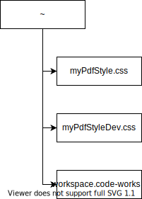

## How to use the setting placement scripts

### for Linux and macOS
If target environment is Linux or macOS, you do following command.
```
./setting.sh
```

The placement of setting files is described following figure.




### for Windows
T.B.D.

